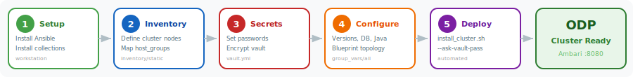
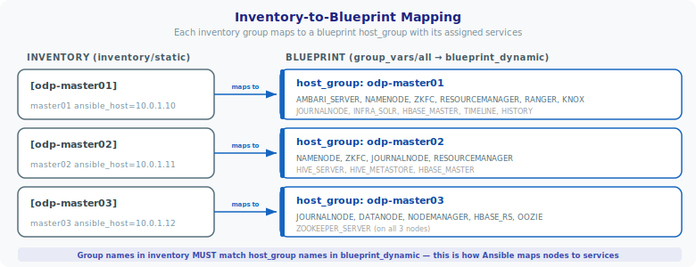
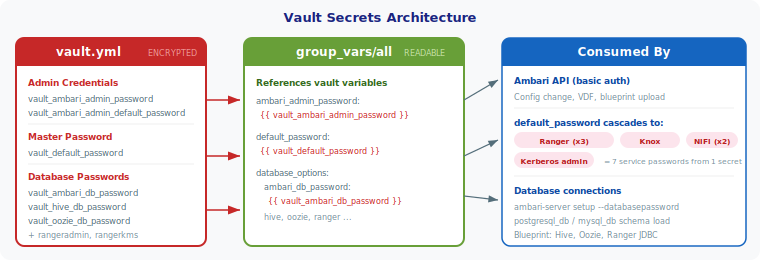
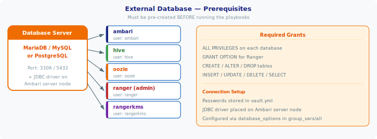

# Installation Guide — Static Inventory

Deploy an Acceldata ODP cluster on pre-built infrastructure using a static Ansible inventory.



---

## Table of Contents

- [1. Workstation Setup](#1-workstation-setup)
- [2. Set the Inventory](#2-set-the-inventory)
- [3. Configure Vault Secrets](#3-configure-vault-secrets)
- [4. Configure Cluster Variables](#4-configure-cluster-variables)
- [5. Deploy the Cluster](#5-deploy-the-cluster)
- [6. Multiple Clusters (Optional)](#6-multiple-clusters-optional)
- [7. Post-Deployment](#7-post-deployment)
- [Pre-Deployment Checklist](#pre-deployment-checklist)
- [Troubleshooting](#troubleshooting)

---

> **Prerequisites:** All cluster nodes must be reachable via SSH and have RHEL 8 or RHEL 9 (or compatible) installed.
>
> **Air-gapped installs:** three artifacts must be staged before running the playbooks — Ansible collections, the Ambari/ODP RPM mirror, and JDBC drivers. See [collections tarballs](#install-collections-only-if-using-ansible-core), [`repo_base_url` → local mirror](#4-configure-cluster-variables), and [JDBC driver download](#4-configure-cluster-variables) respectively. For Oracle, also see [Oracle Instant Client](docs/ORACLE_PREREQ.md#1-install-oracle-instant-client-sqlplus).

## 1. Workstation Setup

> **Ansible Tower / AWX users:** Tower installs collections automatically from `requirements.yml` at project sync. Skip to [Set the Inventory](#2-set-the-inventory).

The workstation (or one of the cluster nodes) must have Ansible installed and SSH access to all nodes.

### Install Ansible

**Recommended — full `ansible` package** (includes all required collections):

```bash
sudo dnf -y install epel-release
sudo dnf -y install ansible
```

**Alternative — `ansible-core` only** (minimal, requires manual collection install):

```bash
sudo dnf -y install ansible-core
```

### Install Collections (only if using `ansible-core`)

> Skip this if you installed the full `ansible` package.

**Verify collections:**

```bash
ansible-galaxy collection list | grep -E "ansible.posix|community.general|community.postgresql|community.mysql"
```

**Online install:**

```bash
ansible-galaxy collection install -r requirements.yml
```

**Air-gapped install:**

```bash
# On a machine with internet — download tarballs:
ansible-galaxy collection download -r requirements.yml -p ./collections-tarballs

# On the air-gapped workstation — install from tarballs:
ansible-galaxy collection install ./collections-tarballs/*.tar.gz -p ./collections
```

## 2. Set the Inventory

Edit `inventory/static` to define your cluster nodes:

```ini
[odp-master01]
master01 ansible_host=10.0.1.10 ansible_user=root ansible_ssh_private_key_file="~/.ssh/id_rsa"

[odp-master02]
master02 ansible_host=10.0.1.11 ansible_user=root ansible_ssh_private_key_file="~/.ssh/id_rsa"

[odp-master03]
master03 ansible_host=10.0.1.12 ansible_user=root ansible_ssh_private_key_file="~/.ssh/id_rsa"
```

Each inventory group name must match the `host_group` names in your blueprint configuration (`blueprint_dynamic` in `group_vars/all`).



### Inventory variables

| Variable | Description |
| ---------- | ------------- |
| `ansible_host` | DNS name or IP of the node |
| `ansible_user` | SSH user with sudo privileges |
| `ansible_ssh_private_key_file` | Path to SSH private key |
| `ansible_ssh_pass` | SSH password (alternative to key) |
| `rack` | (Optional) Rack info. Default: `/default-rack` |

### Verify connectivity

```bash
ansible -i inventory/static all --list-hosts
ansible -i inventory/static all -m ping
```

## 3. Configure Vault Secrets

All passwords are stored in `vault.yml` at the project root, encrypted with Ansible Vault.



### Vault password file

The vault password is read from `.vault_password` (configured in `ansible.cfg`).
This file is git-ignored and must be created on each workstation.

```bash
# Set your vault password (replace 'changeme' with a strong password)
echo 'YOUR_VAULT_PASSWORD' > .vault_password
chmod 600 .vault_password
```

### First-time setup — edit and encrypt

```bash
# Edit the plaintext vault file with your passwords
vi vault.yml

# Encrypt it (uses .vault_password automatically)
ansible-vault encrypt vault.yml
```

### Edit encrypted vault

```bash
ansible-vault edit vault.yml
```

### Change the vault password

```bash
# 1. Update .vault_password with the new password
echo 'NEW_PASSWORD' > .vault_password
chmod 600 .vault_password

# 2. Re-encrypt vault.yml with the new password
ansible-vault rekey vault.yml
```

**Vault variables:**

| Variable | Purpose |
| ---------- | --------- |
| `vault_ambari_admin_password` | Ambari admin UI password |
| `vault_ambari_admin_default_password` | Ambari default password (for change flow) |
| `vault_default_password` | Base password for Ranger, Knox, NiFi, Kerberos |
| `vault_ambari_db_password` | Ambari database password |
| `vault_hive_db_password` | Hive metastore database password |
| `vault_oozie_db_password` | Oozie database password |
| `vault_rangeradmin_db_password` | Ranger Admin database password |
| `vault_rangerkms_db_password` | Ranger KMS database password |

## 4. Configure Cluster Variables

Edit `playbooks/group_vars/all` to set the cluster configuration.

### Cluster identity

| Variable | Description | Example |
| ---------- | ------------- | --------- |
| `cluster_name` | Cluster name | `'odp'` |
| `ambari_version` | Ambari version (4-part) | `'3.0.0.0-101'` |
| `odp_version` | ODP version (4-part) | `'3.3.6.3'` |
| `odp_build_number` | ODP build number | `'101'` |
| `odp_version_full` | Full version with build (auto-derived) | `"{{ odp_version }}-{{ odp_build_number }}"` |
| `repo_base_url` | Base mirror URL (all repo URLs are auto-constructed from this) | `'https://mirror.odp.acceldata.dev'` |

### Repository URLs (auto-constructed, override for local mirrors)

| Variable | Description |
| ---------- | ------------- |
| `ambari_repo_url` | Ambari RPM repository URL |
| `odp_repo_url` | ODP stack repository URL |
| `odp_utils_repo_url` | ODP utilities repository URL |

### General options

| Variable | Description | Default |
| ---------- | ------------- | --------- |
| `external_dns` | Use existing DNS (`true`) or populate `/etc/hosts` (`false`) | `true` |
| `disable_firewall` | Disable local firewall service | `true` |
| `disable_selinux` | Disable SELinux on all nodes | `true` |
| `disable_thp` | Disable Transparent Huge Pages | `true` |
| `set_timezone` | Set timezone on all nodes | `false` |
| `timezone` | Timezone name (only when `set_timezone: true`) | `'UTC'` |

### Java

By default, the playbook installs OpenJDK on all nodes (`java: 'openjdk'`). Set `openjdk_package` and `java_home` to match your required JDK version.

| Variable | Description | Default |
| ---------- | ------------- | --------- |
| `java` | `'openjdk'` (install), `'custom'` (pre-installed), or `'embedded'` (Ambari managed) | `'openjdk'` |
| `openjdk_package` | JDK package to install (when `java: 'openjdk'`) | `'java-17-openjdk-devel'` |
| `java_home` | Path to JAVA_HOME (must match the installed JDK) | `'/usr/lib/jvm/java-17-openjdk'` |

**Available JDK packages (RHEL 8/9):**

| JDK Version | `openjdk_package`       | `java_home`                    |
| ------------- | ------------------------- | -------------------------------- |
| JDK 17      | `java-17-openjdk-devel` | `/usr/lib/jvm/java-17-openjdk` |
| JDK 11      | `java-11-openjdk-devel` | `/usr/lib/jvm/java-11-openjdk` |

> If JDK is already installed on all nodes, set `java: 'custom'` and update `java_home` to point to the existing JAVA_HOME path. The playbook will validate the path exists on every node.

### External database



> All databases, users, and privileges must be pre-created before running the playbooks.

| Variable | Description |
| ---------- | ------------- |
| `database` | `'postgres'`, `'mysql'`, `'mariadb'`, or `'oracle'` |
| `jdbc_driver_path` | Path to JDBC driver JAR on Ambari server node (must already exist) |
| `database_options.external_hostname` | Database server hostname or IP |

**JDBC driver must be present on the Ambari server node before running Phase 2.** The playbook will fail with a clear error if the driver is missing.

**MySQL / MariaDB** (MySQL Connector/J 8.0.x works with both MySQL 8 and MariaDB 10.11):

```bash
# Download the driver (run on the Ambari server node)
sudo mkdir -p /usr/share/java
sudo curl -Lo /usr/share/java/mysql-connector-java.jar \
  https://repo1.maven.org/maven2/com/mysql/mysql-connector-j/8.0.33/mysql-connector-j-8.0.33.jar
```

```yaml
# group_vars/all
database: 'mariadb'                   # or 'mysql'
jdbc_driver_path: '/usr/share/java/mysql-connector-java.jar'
```

**PostgreSQL**:

```bash
# Download the driver (run on the Ambari server node)
sudo mkdir -p /usr/share/java
sudo curl -Lo /usr/share/java/postgresql-jdbc.jar \
  https://repo1.maven.org/maven2/org/postgresql/postgresql/42.7.3/postgresql-42.7.3.jar
```

```yaml
# group_vars/all
database: 'postgres'
jdbc_driver_path: '/usr/share/java/postgresql-jdbc.jar'
```

**Oracle 19c**:

> **Security warning:** the SQL blocks below are illustrative templates. Replace every `<password>` placeholder with a strong, unique password and store it in `vault.yml` — never commit real credentials to Git or use the example literals in production.

```bash
# Copy the Oracle JDBC driver to the Ambari server node
# The ojdbc8.jar is typically found in $ORACLE_HOME/jdbc/lib/ on the Oracle DB server
sudo mkdir -p /usr/share/java
sudo cp /path/to/ojdbc8.jar /usr/share/java/ojdbc8.jar
```

```yaml
# group_vars/all
database: 'oracle'
jdbc_driver_path: '/usr/share/java/ojdbc8.jar'
```

Additional Oracle-specific variables (set in `group_vars/all` under the database section):

| Variable | Description | Default |
| ---------- | ------------- | --------- |
| `oracle_sid` | Oracle SID / service name — used in JDBC URLs and schema loading. Verify with `SELECT instance_name FROM v$instance;` | `'ACCELDATA'` |
| `oracle_home` | ORACLE_HOME path on the DB server. **Only needed when `oracle_load_ambari_schema` is `true`** — the playbook uses it to locate the `sqlplus` binary for loading the Ambari DDL. If you set `oracle_load_ambari_schema: false` (customer loads DDLs manually), this variable is unused and can be left at the default. | `'/opt/oracle/product/19c/dbhome_1'` |
| `oracle_load_ambari_schema` | Set to `false` to skip automatic Ambari DDL loading via `sqlplus`. When `false`, `oracle_home` is not needed. | `true` |

> Oracle uses a single SID with different user/schemas per service. The `*_db_name` variables in `database_options` serve as schema names.
>
> For air-gapped environments, download the JAR on a connected machine and copy it to `/usr/share/java/` on the Ambari server node.
>
> For Oracle Instant Client setup, sqlplus installation, and manual DDL loading, see [docs/ORACLE_PREREQ.md](docs/ORACLE_PREREQ.md).

**Oracle database preparation** — create users, tablespaces, and grants before running the playbooks:

```sql
-- Ambari (uses default USERS tablespace)
CREATE USER ambari IDENTIFIED BY <password>
  DEFAULT TABLESPACE USERS TEMPORARY TABLESPACE TEMP;
GRANT UNLIMITED TABLESPACE TO ambari;
GRANT CREATE SESSION, CREATE TABLE, CREATE SEQUENCE TO ambari;

-- Hive (uses default USERS tablespace)
CREATE USER hive IDENTIFIED BY <password>
  DEFAULT TABLESPACE USERS TEMPORARY TABLESPACE TEMP;
GRANT UNLIMITED TABLESPACE TO hive;
GRANT CREATE SESSION, CREATE TABLE, CREATE SEQUENCE TO hive;

-- Oozie (uses default USERS tablespace)
CREATE USER oozie IDENTIFIED BY <password>
  DEFAULT TABLESPACE USERS TEMPORARY TABLESPACE TEMP;
GRANT UNLIMITED TABLESPACE TO oozie;
GRANT CREATE SESSION, CREATE TABLE, CREATE SEQUENCE TO oozie;

-- Ranger Admin (dedicated tablespace)
CREATE TABLESPACE rangerdba
  DATAFILE '/opt/oracle/oradata/<SID>/rangerdba.dbf'
  SIZE 100M AUTOEXTEND ON NEXT 10M MAXSIZE UNLIMITED;
CREATE USER rangerdba IDENTIFIED BY <password>
  DEFAULT TABLESPACE rangerdba TEMPORARY TABLESPACE TEMP
  QUOTA UNLIMITED ON rangerdba;
GRANT CONNECT, RESOURCE TO rangerdba;
GRANT CREATE SESSION, CREATE TABLE, CREATE SEQUENCE, CREATE VIEW TO rangerdba;

-- Ranger KMS (dedicated tablespace)
CREATE TABLESPACE rangerkms
  DATAFILE '/opt/oracle/oradata/<SID>/rangerkms.dbf'
  SIZE 100M AUTOEXTEND ON NEXT 10M MAXSIZE UNLIMITED;
CREATE USER rangerkms IDENTIFIED BY <password>
  DEFAULT TABLESPACE rangerkms TEMPORARY TABLESPACE TEMP
  QUOTA UNLIMITED ON rangerkms;
GRANT CONNECT, RESOURCE TO rangerkms;
GRANT CREATE SESSION, CREATE TABLE, CREATE SEQUENCE, CREATE VIEW TO rangerkms;
```

> Replace `<SID>` with your Oracle instance name and `<password>` with secure passwords matching `vault.yml`. Ensure `database_options` usernames in `group_vars/all` match the Oracle users created above (e.g. `rangeradmin_db_username: 'rangerdba'`).

The following databases must be pre-created with corresponding users and privileges. Non-secret identifiers live in `group_vars/all` under `database_options`; all passwords live in `vault.yml`.

**`group_vars/all` → `database_options` (non-secret):**

| Service | DB name key | Username key |
| ------- | ----------- | ------------ |
| Ambari | `ambari_db_name` | `ambari_db_username` |
| Hive | `hive_db_name` | `hive_db_username` |
| Oozie | `oozie_db_name` | `oozie_db_username` |
| Ranger Admin | `rangeradmin_db_name` | `rangeradmin_db_username` |
| Ranger KMS | `rangerkms_db_name` | `rangerkms_db_username` |

**`vault.yml` (secrets):**

| Service | Vault variable |
| ------- | -------------- |
| Ambari | `vault_ambari_db_password` |
| Hive | `vault_hive_db_password` |
| Oozie | `vault_oozie_db_password` |
| Ranger Admin | `vault_rangeradmin_db_password` |
| Ranger KMS | `vault_rangerkms_db_password` |

> Database passwords are never stored in `group_vars` — only in `vault.yml`.
>
> **Back up the database before first run.** Phase 2 loads the Ambari DDL (and optionally the Oracle Ambari DDL when `oracle_load_ambari_schema: true`). If the target database contains any prior state, take a snapshot or export first — the DDL load is not reversible.

### Kerberos (optional)

| Variable | Description |
| ---------- | ------------- |
| `security` | `'none'` or `'active-directory'` |
| `security_options.external_hostname` | KDC / Active Directory hostname |
| `security_options.realm` | Kerberos realm (e.g., `'EXAMPLE.COM'`) |
| `security_options.admin_principal` | Kerberos admin principal |
| `security_options.ldap_url` | LDAPS URL (AD only) |
| `security_options.container_dn` | DN for service principal container (AD only) |
| `security_options.http_authentication` | Enable SPNEGO for UIs (`true`/`false`) |
| `security_options.manage_krb5_conf` | Let Ambari manage krb5.conf (`false` for FreeIPA/IdM) |

### Ranger

| Variable | Description |
| ---------- | ------------- |
| `ranger_options.enable_plugins` | Enable Ranger plugins for all services (`true`/`false`) |
| `ranger_security_options.ranger_admin_password` | Ranger admin password (defaults to `{{ default_password }}`) |
| `ranger_security_options.ranger_keyadmin_password` | Ranger key admin password (defaults to `{{ default_password }}`) |
| `ranger_security_options.kms_master_key_password` | KMS master key encryption password (defaults to `{{ default_password }}`) |

### Knox

| Variable | Description |
| ---------- | ------------- |
| `knox_security_options.master_secret` | Knox gateway master secret (defaults to `{{ default_password }}`) |

### NiFi

| Variable | Description |
| ---------- | ------------- |
| `nifi_security_options.encrypt_password` | NiFi configuration encryption password (defaults to `{{ default_password }}`) |
| `nifi_security_options.sensitive_props_key` | NiFi sensitive properties key (defaults to `{{ default_password }}`) |

> All security passwords above default to `{{ default_password }}` which resolves to `vault_default_password` from the vault. Change the vault value to update all at once, or override individual passwords in `group_vars/all`.

### Ambari

| Variable | Description | Default |
| ---------- | ------------- | --------- |
| `ambari_admin_user` | Ambari admin username | `'admin'` |
| `config_recommendation_strategy` | Blueprint config strategy | `'ALWAYS_APPLY_DONT_OVERRIDE_CUSTOM_VALUES'` |
| `wait` | Wait for cluster build to complete | `true` |
| `wait_timeout` | Max wait time in seconds | `3600` |
| `accept_gpl` | Accept GPL licensed packages | `false` |
| `cluster_template_file` | Cluster creation template | `'cluster_template.j2'` |

### Blueprint

| Variable | Description |
| ---------- | ------------- |
| `blueprint_name` | Name stored in Ambari |
| `blueprint_file` | `'blueprint_dynamic.j2'` (generated) or path to static JSON |
| `blueprint_dynamic` | Service-to-host-group mapping (see `group_vars/all` for examples) |

### Paths (optional)

Override data and log directories. See `playbooks/roles/ambari_blueprint/defaults/main.yml` for all available path variables.

| Variable | Description | Default |
| ---------- | ------------- | --------- |
| `base_log_dir` | Base log directory | `'/var/log'` |
| `base_tmp_dir` | Base temp directory | `'/tmp'` |
| `postgres_port` | PostgreSQL port | `5432` |
| `mysql_port` | MySQL/MariaDB port | `3306` |

## 5. Deploy the Cluster

> The vault password file (`.vault_password`) must exist before running any playbook. See [Configure Vault Secrets](#3-configure-vault-secrets).
>
> `--ask-vault-pass` is not needed — `ansible.cfg` reads the password from `.vault_password` automatically.

### Option A — Run all phases at once

```bash
bash install_cluster.sh
```

This runs Phase 1 through Phase 4 sequentially.

### Option B — Run phases individually

Useful for debugging, resuming after a failure, or when you only need a specific phase.

**Phase 1 — Prepare nodes** (OS packages, Java, NTP, firewall, SELinux, THP):

```bash
bash prepare_nodes.sh
```

**Phase 2 — Install Ambari** (Ambari agent on all nodes, Ambari server on the designated node):

```bash
bash install_ambari.sh
```

**Phase 3 — Configure Ambari** (admin password, GPL license, VDF upload, repository URLs, agent sync):

```bash
bash configure_ambari.sh
```

**Phase 4 — Apply blueprint** (upload blueprint, create cluster, wait for deployment):

```bash
bash apply_blueprint.sh
```

### Validate the blueprint before deploying

Run the blueprint validation playbook to catch configuration errors before starting a long deployment:

```bash
ansible-playbook playbooks/check_dynamic_blueprint.yml
```

This checks that inventory group names match `blueprint_dynamic`, validates component placement, and renders the blueprint JSON without uploading it.

### Using ansible-playbook directly

```bash
# All phases
ansible-playbook playbooks/install_cluster.yml

# Individual phases
ansible-playbook playbooks/prepare_nodes.yml
ansible-playbook playbooks/install_ambari.yml
ansible-playbook playbooks/configure_ambari.yml
ansible-playbook playbooks/apply_blueprint.yml
```

### Using tags

The master playbook supports tags to run specific phases without separate playbook files:

```bash
# Prepare nodes only
ansible-playbook playbooks/install_cluster.yml --tags prepare_nodes

# Ambari install + configure (Phase 2 & 3)
ansible-playbook playbooks/install_cluster.yml --tags ambari

# Configure + blueprint (Phase 3 & 4)
ansible-playbook playbooks/install_cluster.yml --tags blueprint
```

| Tag | Phases included |
| --- | --------------- |
| `prepare_nodes` | Phase 1 |
| `ambari` | Phase 2 + Phase 3 |
| `blueprint` | Phase 3 + Phase 4 |

## 6. Multiple Clusters (Optional)

To manage multiple clusters from the same project:

### Create per-cluster inventory

```bash
cp inventory/static inventory/my_cluster
vi inventory/my_cluster
```

### Create per-cluster variables

```bash
cp playbooks/group_vars/all playbooks/group_vars/my_cluster
vi playbooks/group_vars/my_cluster
```

### Deploy with custom inventory

```bash
bash install_cluster.sh -i inventory/my_cluster
```

## 7. Post-Deployment

After a successful deployment, the cluster is fully operational.

### Access the Ambari UI

Open `http://<ambari-server-hostname>:8080` in your browser and log in with:

- **Username:** `admin`
- **Password:** the value of `vault_ambari_admin_password` from `vault.yml`

### Verify cluster health

In the Ambari UI, check that:

- All services show a green status
- All hosts are registered and heartbeating
- No alerts are active

### Common post-deployment tasks

| Task | How |
| ---- | --- |
| Start a stopped service | Ambari UI > Service > Actions > Start |
| Add worker nodes | Add hosts to `[odp-workers]` in `inventory/static`, re-run Phase 1 and Phase 2, then add hosts via Ambari UI |
| Change Ambari admin password | Ambari UI > admin dropdown > Manage Ambari > Change Password |
| Enable Kerberos after initial deploy | Set `security: 'active-directory'` in `group_vars/all`, configure `security_options`, then enable via Ambari UI wizard |
| Check cluster logs | SSH to node, check `/var/log/ambari-server/` or `/var/log/ambari-agent/` |
| Re-run playbooks safely | All phases are idempotent — re-run any phase without side effects |

## Pre-Deployment Checklist

Verify all items before running `install_cluster.sh`:

### Infrastructure

- [ ] All cluster nodes running RHEL 8 or RHEL 9 (or compatible: Rocky Linux, AlmaLinux)
- [ ] SSH access from workstation to all nodes (key-based or password)
- [ ] Sufficient disk, memory, and CPU on all nodes for the planned services
- [ ] Network connectivity between all cluster nodes (no firewall blocking inter-node traffic)
- [ ] Corporate / network firewall permits the Ambari and ODP service ports listed in [README.md → Network & Ports](README.md#network--ports)

### Workstation

- [ ] Ansible 2.16+ installed (`ansible --version`)
- [ ] Required collections available (`ansible-galaxy collection list`)
- [ ] Vault password file created (`.vault_password`) with correct permissions (`chmod 600`)
- [ ] Vault encrypted (`head -1 vault.yml` should show `$ANSIBLE_VAULT;1.1;AES256`)

### Inventory

- [ ] `inventory/static` updated with all node hostnames/IPs
- [ ] Inventory group names match `host_group` names in `blueprint_dynamic` (in `group_vars/all`)
- [ ] SSH connectivity verified (`ansible all -m ping`)

### Database

- [ ] External database server (MySQL, MariaDB, PostgreSQL, or Oracle 19c) running and reachable
- [ ] All required databases created: `ambari`, `hive`, `oozie`, `ranger`, `rangerkms`
- [ ] Database users created with appropriate privileges (for Oracle, see [docs/ORACLE_PREREQ.md](docs/ORACLE_PREREQ.md))
- [ ] JDBC driver JAR present on the Ambari server node (e.g., `mysql-connector-java.jar`, `postgresql-jdbc.jar`, or `ojdbc8.jar` in `/usr/share/java/`)
- [ ] `database_options.external_hostname` set to actual hostname (not the placeholder `EXTERNAL-DB-HOSTNAME`)
- [ ] External database snapshot / export taken — the first playbook run loads DDL and is not reversible

### Java Runtime

- [ ] If `java: 'openjdk'` (default): nodes have internet or local repo access to install the JDK package
- [ ] If `java: 'custom'`: JDK already installed on all nodes and `java_home` path is correct

### Variables

- [ ] `cluster_name` set in `group_vars/all`
- [ ] `ambari_version` and `odp_version` match your target release
- [ ] `repo_base_url` reachable from all nodes (`curl -s <repo_base_url>`)
- [ ] `database` type and `jdbc_driver_path` match the installed driver
- [ ] Vault passwords updated from defaults (`ansible-vault edit vault.yml`)

## Troubleshooting

### Phase 1 — Prepare Nodes

| Problem | Solution |
| ------- | -------- |
| Package install fails | Check `repo_base_url` is reachable from nodes. For air-gapped installs, verify local mirror is configured |
| Java validation fails | Confirm `java_home` path exists. Run `ls -d /usr/lib/jvm/java-*` on the node to find the correct path |
| NTP check fails | Ensure `chronyd` is installed and the time source is reachable |

### Phase 2 — Install Ambari

| Problem | Solution |
| ------- | -------- |
| Ambari repo not found | Check `ambari_repo_url` is reachable. Verify the `.repo` file was created under `/etc/yum.repos.d/` |
| JDBC driver missing | Download the driver JAR to `/usr/share/java/` on the Ambari server node before running Phase 2 |
| DB schema load fails | Verify database exists, user has correct grants, and password in `vault.yml` matches |
| `ambari-server setup` fails | Check `/var/log/ambari-server/ambari-server.log` for details |

### Phase 3 — Configure Ambari

| Problem | Solution |
| ------- | -------- |
| VDF upload fails (HTTP 500) | Ambari server may not be fully started. Wait 30 seconds and retry |
| Admin password change fails | Verify `vault_ambari_admin_default_password` matches the current Ambari default (`admin`) |
| Agent registration timeout | Check `/var/log/ambari-agent/ambari-agent.log` on each node. Verify hostname resolution and firewall rules |

### Phase 4 — Apply Blueprint

| Problem | Solution |
| ------- | -------- |
| Blueprint validation error | Run `ansible-playbook playbooks/check_dynamic_blueprint.yml` to validate before deploying |
| Cluster creation times out | Increase `wait_timeout` in `group_vars/all`. Check Ambari UI > Background Operations for stuck tasks |
| Service fails to start | Check service-specific logs in `/var/log/<service>/` on the relevant node. Common causes: port conflicts, insufficient memory |
| `PLACEHOLDER` in variables | Search `group_vars/all` for `PLACEHOLDER` and replace with actual values |

### General

```bash
# Check Ambari server status
ssh <ambari-server> 'ambari-server status'

# View Ambari server log
ssh <ambari-server> 'tail -100 /var/log/ambari-server/ambari-server.log'

# View Ambari agent log on a node
ssh <node> 'tail -100 /var/log/ambari-agent/ambari-agent.log'

# Re-run a specific phase after fixing an issue
bash prepare_nodes.sh    # Phase 1
bash install_ambari.sh   # Phase 2
bash configure_ambari.sh # Phase 3
bash apply_blueprint.sh  # Phase 4
```

> All playbooks are idempotent. After fixing an issue, re-run the failed phase — completed tasks are skipped automatically.

### Tuning ansible.cfg

The included `ansible.cfg` ships with production-ready defaults. Key settings you may want to adjust:

| Setting | Default | When to change |
| ------- | ------- | -------------- |
| `forks` | `40` | Increase for very large clusters (100+ nodes) or decrease on resource-constrained workstations |
| `timeout` | `60` | Increase if SSH connections time out on high-latency networks |
| `host_key_checking` | `False` | Set to `True` in environments that require strict SSH host key verification |

SSH multiplexing (`ControlMaster`, `ControlPersist=120s`) is enabled by default for faster execution across repeated connections.
