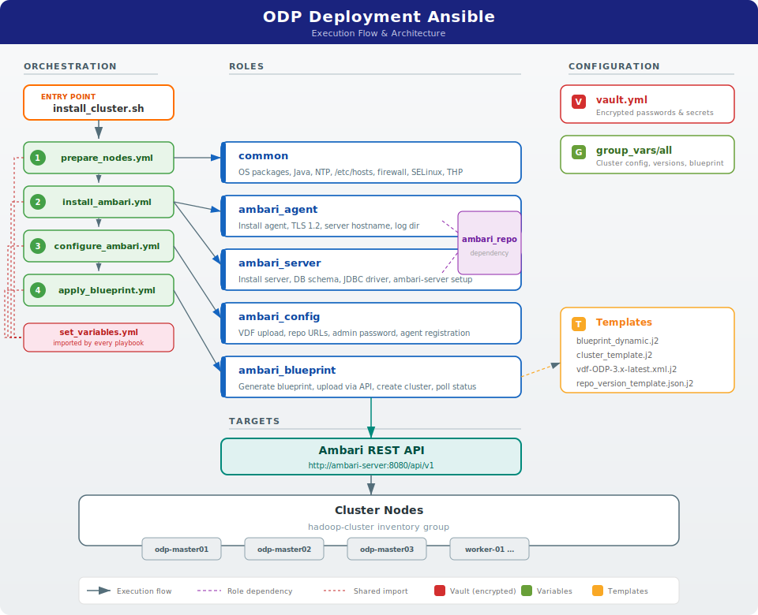
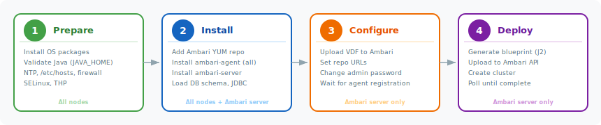
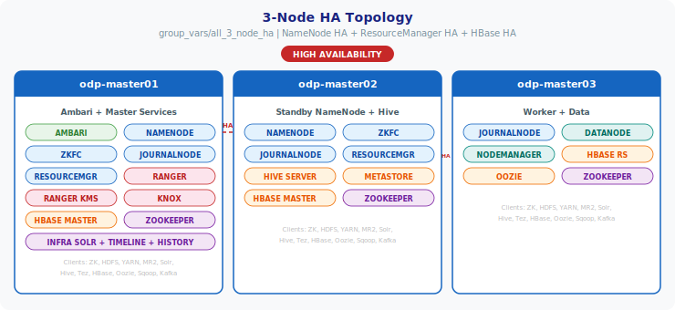
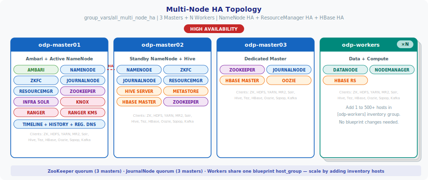
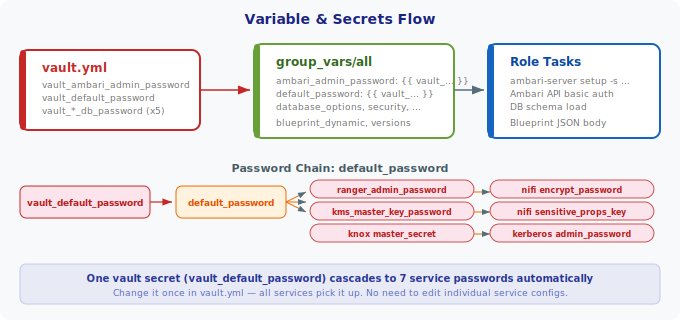

# ODP Deployment Ansible

Ansible playbooks for deploying **Acceldata ODP** (Open Data Platform) clusters using Ambari Blueprints.



---

## Table of Contents

- [Highlights](#highlights)
- [Quick Start](#quick-start)
- [Deployment Phases](#deployment-phases)
- [Blueprint Topologies](#blueprint-topologies)
- [Secrets Management](#secrets-management)
- [Dynamic Blueprint Services](#dynamic-blueprint-services)
- [Project Structure](#project-structure)
- [Roles](#roles)
- [Security & Compliance](#security--compliance)
- [Requirements](#requirements)
- [Troubleshooting](#troubleshooting)
- [License](#license)

---

## Highlights

| Feature | Detail |
| ------- | ------ |
| **ODP 3.x** | Acceldata Open Data Platform on Ambari 3.x |
| **OS support** | RHEL 8 / RHEL 9 (Rocky Linux, AlmaLinux) |
| **Automation** | Ansible CLI + Ansible Tower / AWX |
| **Secrets** | Ansible Vault with cascading master password |
| **Blueprints** | Dynamic (Jinja2) or static JSON |
| **High Availability** | NameNode, ResourceManager, HBase, Ranger KMS |
| **Air-gapped** | Pre-downloaded collection tarballs, local mirrors |

## Quick Start

```bash
# 1. Configure your inventory
vi inventory/static

# 2. Edit cluster variables
vi playbooks/group_vars/all

# 3. Set vault password and encrypt secrets
echo 'YOUR_VAULT_PASSWORD' > .vault_password && chmod 600 .vault_password
ansible-vault encrypt vault.yml

# 4. Deploy the cluster
bash install_cluster.sh
```

After deployment completes, the Ambari UI is available at `http://<ambari-server>:8080`.

See [INSTALL_static.md](INSTALL_static.md) for detailed step-by-step instructions.

## Deployment Phases



| Phase | Script | Roles | Target | What it does |
| ----- | ------ | ----- | ------ | ------------ |
| **1** | `prepare_nodes.sh` | `common` | All nodes | OS packages, Java, NTP, firewall, SELinux, THP |
| **2** | `install_ambari.sh` | `ambari_repo`, `ambari_agent`, `ambari_server` | All nodes + server | YUM repo, Ambari agent & server, DB schema |
| **3** | `configure_ambari.sh` | `ambari_config` | Ambari server | VDF, repo URLs, admin password, agent sync |
| **4** | `apply_blueprint.sh` | `ambari_blueprint` | Ambari server | Blueprint generation, API upload, cluster creation |

All phases share `set_variables.yml` which initializes dynamic groups and computes helper variables.

```bash
# Run all phases at once
bash install_cluster.sh

# Or run individually
bash prepare_nodes.sh
bash install_ambari.sh
bash configure_ambari.sh
bash apply_blueprint.sh
```

## Blueprint Topologies

Three reference topologies are included. Copy the desired layout to `group_vars/all`:

```bash
cp playbooks/group_vars/all_3_node_ha playbooks/group_vars/all
```

### 1-Node All-in-One

| File | Layout | Use case |
| ---- | ------ | -------- |
| `group_vars/all` | 1-node | Development, testing, PoC — every service on a single node |

### 3-Node HA



| File | Layout | Use case |
| ---- | ------ | -------- |
| `group_vars/all_3_node` | 3-node | Small cluster, master/master/worker split, no HA |
| `group_vars/all_3_node_ha` | 3-node HA | Small production — NameNode HA, ResourceManager HA, HBase HA |

### Multi-Node HA (Production)



| File | Layout | Use case |
| ---- | ------ | -------- |
| custom | 3+ masters, N workers | Production — scale workers by adding hosts to `[odp-workers]` inventory group |

## Secrets Management


All passwords are stored in `vault.yml` at the project root, encrypted with Ansible Vault. One master password (`vault_default_password`) cascades to 7 service passwords automatically.



```bash
# Edit secrets
ansible-vault edit vault.yml

# Encrypt (first time)
ansible-vault encrypt vault.yml
```

**Tower/AWX users:** add a Vault Credential to the Job Template — no `.vault_password` file needed.

## Dynamic Blueprint Services

| Category | Services |
| -------- | -------- |
| **Core** | HDFS, YARN + MapReduce2, ZooKeeper, Tez |
| **Data** | Hive, HBase, Oozie, Kafka, Sqoop |
| **Security** | Ranger, Ranger KMS, Knox, Kerberos (AD), Infra Solr (Ranger audit) |
| **HA** | NameNode, ResourceManager, HBase, Ranger KMS |

Services are assigned to host groups in `blueprint_dynamic` (inside `group_vars/all`). The Jinja2 template automatically generates the correct Ambari Blueprint JSON.

### Services Available via MPack

The following services are **not included by default** and must be added via [Ambari Management Packs](https://docs.acceldata.io/odp/documentation/odp-working-with-ambari-management-packs) before they can be deployed.

See the [MPacks repository listing](https://docs.acceldata.io/odp/documentation/ambari-repositories1#mpacks-link) for download links and version compatibility.

#### MPack Service Components

| Category | Server / Master Components | Client Components |
| -------- | -------------------------- | ----------------- |
| **Streaming** | `KAFKA3_BROKER`, `FLINK_JOBHISTORYSERVER`, `NIFI_MASTER`, `NIFI_REGISTRY_MASTER`, `REGISTRY_SERVER` | `FLINK_CLIENT` |
| **Compute** | `SPARK3_JOBHISTORYSERVER`, `SPARK3_THRIFTSERVER`, `LIVY3_SERVER`, `SPARK2_JOBHISTORYSERVER`, `IMPALA_DAEMON`, `IMPALA_STATE_STORE`, `IMPALA_CATALOG_SERVICE`, `TRINO_COORDINATOR`, `TRINO_WORKER` | `SPARK3_CLIENT`, `SPARK2_CLIENT` |
| **Storage** | `OZONE_MANAGER`, `OZONE_DATANODE`, `OZONE_STORAGE_CONTAINER_MANAGER`, `OZONE_S3_GATEWAY`, `OZONE_RECON`, `KUDU_MASTER`, `KUDU_TSERVER`, `HTTPFS_GATEWAY` | `OZONE_CLIENT` |
| **Analytics** | `PINOT_CONTROLLER`, `PINOT_SERVER`, `PINOT_BROKER`, `PINOT_MINION`, `CLICKHOUSE_SERVER`, `CLICKHOUSE_WEBSERVER`, `CLICKHOUSE_KEEPER` | `CLICKHOUSE_CLIENT` |
| **ML / Notebooks** | `MLFLOW_SERVER`, `JUPYTERHUB`, `ZEPPELIN_MASTER` | — |
| **Workflow** | `AIRFLOW_SCHEDULER`, `AIRFLOW_WEBSERVER`, `AIRFLOW_WORKER` | — |
| **UI** | `HUE_SERVER` | — |

#### Adding an MPack Service

After installing the management pack on the Ambari server, three files need changes:

**1. `playbooks/group_vars/all`** — add component names to `blueprint_dynamic`:

```yaml
blueprint_dynamic:
  - host_group: "odp-master01"
    clients: ['...existing...', 'SPARK3_CLIENT']   # add client
    services:
      - ...existing...
      - SPARK3_JOBHISTORYSERVER                     # add server component
```

**2. `playbooks/set_variables.yml`** — add helper variable tracking for the new service.

`set_variables.yml` builds host lists that `blueprint_dynamic.j2` uses for HA wiring, Ranger audit targets, and cross-service references. Currently tracked:

| Helper Variable | Populated When Service Present |
| --------------- | ------------------------------ |
| `namenode_groups` | `NAMENODE` |
| `resourcemanager_groups` | `RESOURCEMANAGER` |
| `zookeeper_groups` / `zookeeper_hosts` | `ZOOKEEPER_SERVER` |
| `hiveserver_hosts` | `HIVE_SERVER`, `HIVE_METASTORE`, `SPARK2_JOBHISTORYSERVER` |
| `oozie_hosts` | `OOZIE_SERVER` |
| `kafka_groups` / `kafka_hosts` | `KAFKA_BROKER` |
| `rangeradmin_groups` / `rangeradmin_hosts` | `RANGER_ADMIN`, `RANGER_USERSYNC` |
| `rangerkms_hosts` | `RANGER_KMS_SERVER` |
| `journalnode_groups` | `JOURNALNODE` |
| `zkfc_groups` | `ZKFC` |

MPack services that need new helper variables (follow the same pattern):

| New Helper Variable | Service | Why Needed |
| ------------------- | ------- | ---------- |
| `spark3_hosts` | `SPARK3_JOBHISTORYSERVER` | Spark3 log dir, Livy3 config |
| `nifi_hosts` | `NIFI_MASTER` | NiFi security config, registry URL |
| `impala_hosts` | `IMPALA_STATE_STORE` | Statestore / catalog cross-refs |
| `ozone_hosts` | `OZONE_MANAGER` | Ozone HA wiring, S3 gateway config |
| `kafka3_hosts` | `KAFKA3_BROKER` | Kafka3 ZK / Ranger audit config |
| `trino_hosts` | `TRINO_COORDINATOR` | Coordinator discovery URL |
| `clickhouse_hosts` | `CLICKHOUSE_KEEPER` | Keeper quorum config |
| `pinot_hosts` | `PINOT_CONTROLLER` | Controller discovery, ZK config |

**3. `playbooks/roles/ambari_blueprint/templates/blueprint_dynamic.j2`** — add configuration blocks.

The blueprint template uses `` guards. Currently handled:

| Existing Config Blocks | Services |
| ---------------------- | -------- |
| Kerberos | `kerberos-env`, `krb5-conf` |
| Ranger | `admin-properties`, `ranger-admin-site`, `ranger-env`, all audit plugins (HDFS, Hive, YARN, HBase, Knox, Kafka) |
| Ranger KMS | `kms-properties`, `dbks-site`, `kms-env`, `kms-site`, `ranger-kms-audit` |
| HDFS | `hadoop-env`, `hdfs-site`, `core-site` (includes HA wiring) |
| YARN | `yarn-env`, `yarn-site`, `yarn-hbase-env`, `yarn-hbase-site` (includes RM HA) |
| Hive | `hive-site`, `hiveserver2-site`, `hive-env` |
| HBase | `hbase-site`, `hbase-env` |
| Oozie | `oozie-site`, `oozie-env` |
| Tez | `tez-site`, `tez-env` |
| MapReduce | `mapred-site`, `mapred-env` |
| Sqoop | `sqoop-env` |
| Kafka | `kafka-env`, `kafka-broker` |
| ZooKeeper | `zookeeper-env`, `zoo.cfg` |
| Knox | `knox-env` |
| Infra Solr | `infra-solr-env`, `infra-solr-client-log4j` |
| Spark / Spark2 | `spark-env`, `spark2-env`, `livy-env`, `livy2-env` |
| Zeppelin | `zeppelin-env` |
| Solr (user) | `solr-config-env` |

MPack services that need new config blocks (add using the same `` guard pattern):

| New Config Blocks Needed | Guard Condition |
| ------------------------ | --------------- |
| `spark3-env`, `livy3-env`, `spark3-thrift-sparkconf` | `SPARK3_JOBHISTORYSERVER in blueprint_all_services` |
| `nifi-env`, `nifi-properties`, `nifi-registry-env` | `NIFI_MASTER in blueprint_all_services` |
| `flink-env` | `FLINK_JOBHISTORYSERVER in blueprint_all_services` |
| `kafka3-broker`, `kafka3-env` | `KAFKA3_BROKER in blueprint_all_services` |
| `impala-env`, `impala-catalog`, `impala-statestore` | `IMPALA_STATE_STORE in blueprint_all_services` |
| `trino-config`, `trino-env` | `TRINO_COORDINATOR in blueprint_all_services` |
| `ozone-env`, `ozone-site`, `ozone-recon`, `ozone-scm` | `OZONE_MANAGER in blueprint_all_services` |
| `kudu-env`, `kudu-site` | `KUDU_MASTER in blueprint_all_services` |
| `airflow-env`, `airflow-core-site` | `AIRFLOW_SCHEDULER in blueprint_all_services` |
| `hue-env`, `hue-ini` | `HUE_SERVER in blueprint_all_services` |
| `clickhouse-env`, `clickhouse-config` | `CLICKHOUSE_SERVER in blueprint_all_services` |
| `pinot-env`, `pinot-controller`, `pinot-broker` | `PINOT_CONTROLLER in blueprint_all_services` |
| `mlflow-env` | `MLFLOW_SERVER in blueprint_all_services` |
| `jupyterhub-env` | `JUPYTERHUB in blueprint_all_services` |
| `registry-env`, `registry-common` | `REGISTRY_SERVER in blueprint_all_services` |
| `zeppelin-env` | `ZEPPELIN_MASTER in blueprint_all_services` (already exists) |
| Ranger audit plugins | `ranger-spark3-audit`, `ranger-nifi-audit`, `ranger-ozone-audit`, etc. |

## Project Structure

```text
odp_deployment_ansible/
  ansible.cfg                  # Ansible configuration
  vault.yml                    # Encrypted secrets (ansible-vault)
  requirements.yml             # Required Ansible collections
  install_cluster.sh           # Master orchestration (runs all phases)
  prepare_nodes.sh             # Phase 1: OS preparation
  install_ambari.sh            # Phase 2: Ambari install
  configure_ambari.sh          # Phase 3: Post-install config
  apply_blueprint.sh           # Phase 4: Blueprint deployment
  inventory/
    static                     # Default inventory (edit this)
  playbooks/
    install_cluster.yml        # Master playbook (all phases)
    prepare_nodes.yml          # Phase 1 playbook
    install_ambari.yml         # Phase 2 playbook
    configure_ambari.yml       # Phase 3 playbook
    apply_blueprint.yml        # Phase 4 playbook
    set_variables.yml          # Shared: dynamic groups + helper vars
    group_vars/
      all                      # Cluster configuration (edit this)
      all_3_node               # Reference: 3-node non-HA layout
      all_3_node_ha            # Reference: 3-node HA layout
    roles/
      common/                  # OS prerequisites (Java, NTP, firewall)
      ambari_repo/             # YUM repository setup
      ambari_agent/            # Ambari agent install + config
      ambari_server/           # Ambari server install + DB setup
      ambari_config/           # Post-install configuration
      ambari_blueprint/        # Blueprint generation + cluster creation
  docs/                        # Architecture diagrams (SVG)
  collections-tarballs/        # Pre-downloaded collections (air-gapped)
```

## Roles

See [playbooks/roles/README.md](playbooks/roles/README.md) for detailed role documentation.

| Role | Phase | Applied to | Key tasks |
| ---- | ----- | ---------- | --------- |
| `common` | 1 | All nodes | OS packages, Java validation, NTP, `/etc/hosts`, firewall, SELinux, THP |
| `ambari_repo` | 2 | All nodes | Ambari YUM repository setup (dependency of agent & server) |
| `ambari_agent` | 2 | All nodes | Install agent, set server hostname, TLS 1.2, log directory |
| `ambari_server` | 2 | Ambari server | Install server, DB schema, JDBC driver, `ambari-server setup` |
| `ambari_config` | 3 | Ambari server | GPL license, admin password, VDF upload, repo URLs, agent sync |
| `ambari_blueprint` | 4 | Ambari server | Generate blueprint, upload via API, create cluster, poll status |

## Security & Compliance

These playbooks are designed for enterprise environments and follow security best practices:

| Practice | Detail |
| -------- | ------ |
| **Secrets management** | All passwords encrypted with Ansible Vault (`vault.yml`). No plaintext credentials in playbooks or group_vars |
| **Vault password file** | `.vault_password` has `0600` permissions and is git-ignored by default |
| **No hardcoded secrets** | Passwords use `vault_` prefixed variables; override via Tower/AWX Credential or extra vars |
| **ansible-lint compliant** | Passes `ansible-lint` (basic+ profile) — enforced across all roles and playbooks |
| **Fully Qualified Collection Names** | All modules use FQCN (e.g., `ansible.builtin.uri`, `community.postgresql.postgresql_db`) |
| **Explicit file permissions** | `mode` set on all file, copy, and template tasks |
| **No `ignore_errors`** | Proper `failed_when` conditions instead of blanket error suppression |
| **Minimal shell usage** | `ansible.builtin.command` or native modules preferred; `shell` only where required (e.g., sysfs writes) |
| **Preflight validation** | Checks for placeholder values, JDBC driver existence, Python interpreter, blueprint consistency, and agent registration before proceeding |
| **Idempotent execution** | Safe to re-run — tasks skip already-completed work without side effects |
| **No `become` escalation leaks** | Privilege escalation scoped to play level; delegated tasks use `become: false` |
| **Ansible Tower / AWX ready** | Overridable variables, no local path dependencies, Vault Credential support |

## Requirements

| Requirement | Detail |
| ----------- | ------ |
| **Ansible** | 2.16+ (`ansible` package recommended, or `ansible-core` + collections) |
| **Collections** | `ansible.posix`, `community.general`, `community.postgresql`, `community.mysql` |
| **Target OS** | RHEL 8 / RHEL 9 (or compatible: Rocky Linux, AlmaLinux) |
| **Database** | External MariaDB, MySQL, or PostgreSQL — pre-created |
| **Network** | SSH access from workstation to all cluster nodes |
| **Java** | OpenJDK 17 (default) or OpenJDK 11 |

For detailed OS, JDK, and database compatibility see the [ODP Support Matrix](https://docs.acceldata.io/odp/support-matrix).

## Troubleshooting

| Symptom | Cause | Fix |
| ------- | ----- | --- |
| `UNREACHABLE!` on ping | SSH connectivity issue | Verify `ansible_host`, `ansible_user`, and SSH key in `inventory/static` |
| `Vault password not found` | Missing `.vault_password` | Create the file: `echo 'PASSWORD' > .vault_password && chmod 600 .vault_password` |
| `JDBC driver not found` | Driver JAR not on Ambari server | Download the driver to `/usr/share/java/` on the Ambari server node (see [INSTALL_static.md](INSTALL_static.md#4-configure-cluster-variables)) |
| Phase 3 fails at VDF upload | Ambari server not running | Check `ambari-server status` and `systemctl start ambari-server` |
| Phase 4 hangs or times out | Slow cluster provisioning | Increase `wait_timeout` in `group_vars/all` (default: 3600 seconds) |
| Blueprint validation error | Inventory group names don't match `blueprint_dynamic` | Ensure each `[group]` in `inventory/static` has a matching entry in `blueprint_dynamic` |
| `PLACEHOLDER` error | Unconfigured variables | Search for `PLACEHOLDER` in `group_vars/all` and replace with actual values |
| Agent registration timeout | Agents can't reach server | Check DNS/hosts resolution and firewall between nodes |
| Database schema load fails | Wrong DB credentials or DB not created | Verify databases exist and passwords in `vault.yml` match |

**Re-running after failure:** All playbooks are idempotent. Fix the issue and re-run the same phase — it will skip completed tasks automatically.

## License

Copyright Acceldata, Inc.
